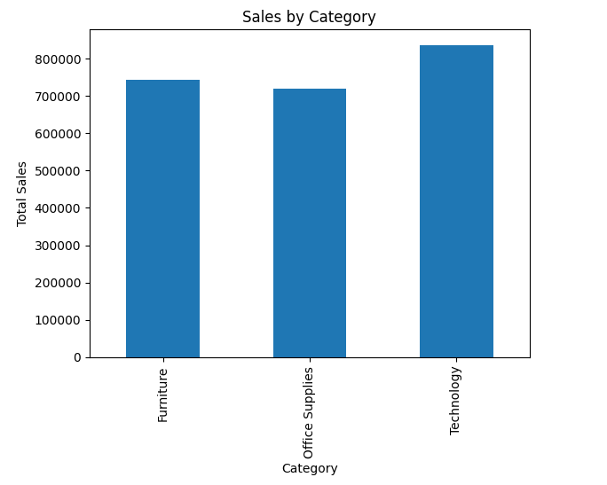
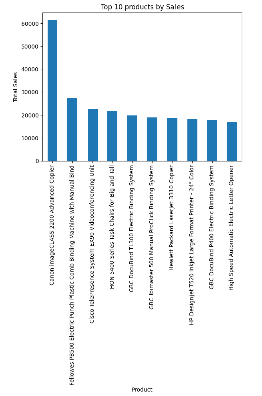
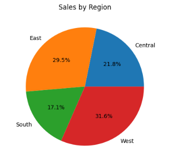
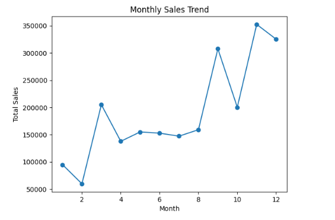
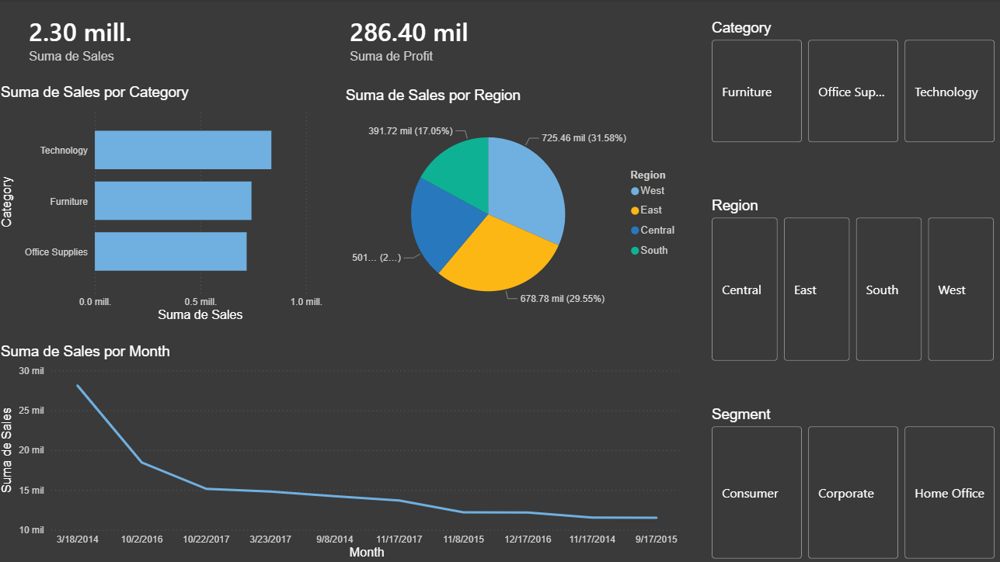
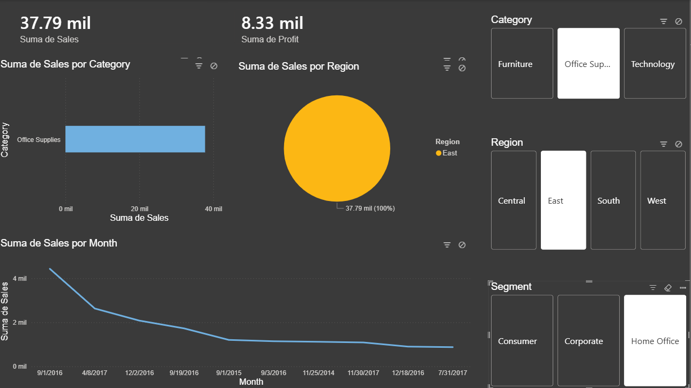
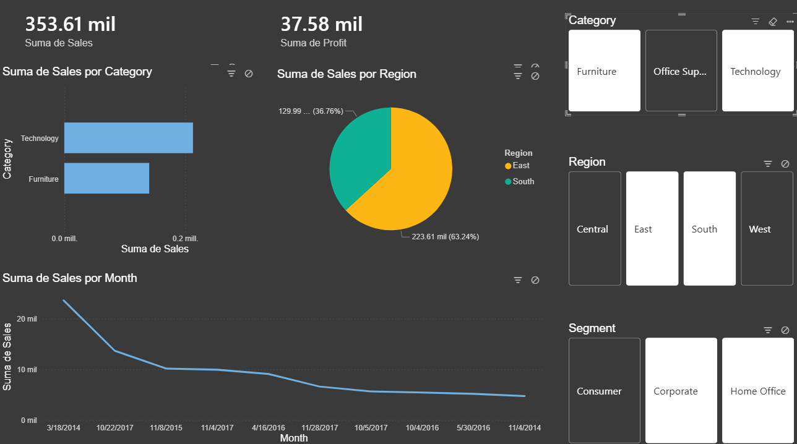

# SQL Data Analysis Portfolio

## Project Overview

This project analyzes retail sales data using Python, SQL, and data visualization techniques.

The goal is to identify:
- top-selling products
- sales trends
- regional performance
- category insights

---

## Technologies Used

- Python
- Pandas
- Matplotlib
- SQL
- Jupyter Notebook
- Git/GitHub

---

## Dataset

Superstore Sales Dataset

---

## Business Questions

- Which categories generate the most revenue?
- What are the top-selling products?
- Which regions perform best?
- How do sales change over time?

---

## Visualizations

### Sales by Category

### Top Products

### Sales by Region

### Monthly Sales Trend

---

## Key Insights

- Technology products generated the highest revenue.
- Some products significantly outperform others.
- Sales vary across regions.
- Monthly trends reveal seasonal behavior.

---

## Future Improvements

- Power BI dashboard
- Advanced SQL queries

- ## Power BI Dashboard

This dashboard includes:

- Sales KPIs
- Profit analysis
- Regional performance
- Monthly trends
- Interactive slicers

### Dashboard Preview

## Advanced SQL Analysis

This project includes advanced SQL techniques such as:

- CTEs
- Window Functions
- Rankings
- CASE Statements
- Profitability Analysis
- Running Totals
- Predictive analytics
- Customer segmentation
